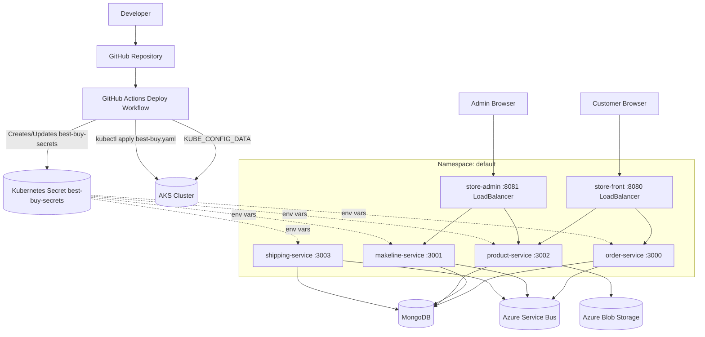

# Cloud-Native App for Best Buy

This repository deploys the Best Buy microservices stack to Kubernetes using GitHub Actions.

## Student Information
- **Name:** Akash Patel
- **Student ID:** 041269598
- **Course:** CST8916 - Winter 2026


## Architecure



## Deploy with GitHub Actions

The workflow file is:

- `.github/workflows/deploy.yml`

It will deploy automatically when:

- You push changes to `main` in `deployment_files/**`
- You run the workflow manually from the **Actions** tab (`workflow_dispatch`)

## Prerequisites

1. A running Kubernetes cluster (AKS, EKS, GKE, or any CNCF-compliant cluster).
2. `kubectl` access from your local machine.
3. A kubeconfig file for that cluster.
4. The Kubernetes secret `best-buy-secrets` created in the target namespace (default namespace if not specified).

## Configure GitHub Secrets

Create these repository secrets:

- `KUBE_CONFIG_DATA`
- `ASERVICE_BUS_CONNECTION_STRING`
- `MONGO_URI`
- `BLOB_CONNECTION_STRING`

Use `KUBE_CONFIG_DATA` as your kubeconfig encoded in base64.

### PowerShell (Windows)

```powershell
$kubeconfigPath = "$HOME\.kube\config"
[Convert]::ToBase64String([IO.File]::ReadAllBytes($kubeconfigPath))
```

Copy the output and add it in GitHub:

- Repo -> Settings -> Secrets and variables -> Actions -> New repository secret
- Name: `KUBE_CONFIG_DATA`
- Value: (paste base64 output)

The workflow will create or update Kubernetes secret `best-buy-secrets` automatically from the three application secrets.

## Run Deployment

1. Push to `main`, or
2. Open **Actions** -> **Deploy to Kubernetes** -> **Run workflow**.

The workflow executes:

1. Authenticate using `KUBE_CONFIG_DATA`
2. Create/update Kubernetes secret `best-buy-secrets`
3. Apply [deployment_files/best-buy.yaml](deployment_files/best-buy.yaml)
4. Wait for rollout success of all deployments

## Troubleshooting

- If deployment fails at kubeconfig step, verify `KUBE_CONFIG_DATA` exists and is valid base64.
- If workflow fails before deploy, verify GitHub Secrets are set: `ASERVICE_BUS_CONNECTION_STRING`, `MONGO_URI`, `BLOB_CONNECTION_STRING`.
- If rollout times out, inspect pods and events:

```bash
kubectl get pods
kubectl describe pod <pod-name>
kubectl get events --sort-by=.metadata.creationTimestamp
```


## Links

### Repository links

| Service          | Link                                               |
| ---------------- | -------------------------------------------------- |
| store-front      | https://github.com/Akash705-hub/store-front-bb      |
| store-admin      | https://github.com/Akash705-hub/store-admin-bb      |
| product-service  | https://github.com/Akash705-hub/product-service-bb  |
| order-service    | https://github.com/Akash705-hub/order-service-bb    |
| makeline-service | https://github.com/Akash705-hub/makeline-service-bb |
| shipping-service | https://github.com/Akash705-hub/shipping-service-bb |

### Docker Hub links

| Service          | Link                                                                          |
| ---------------- | ----------------------------------------------------------------------------- |
| store-front      | https://hub.docker.com/repository/docker/akash0898/store-front-bb/general     |
| store-admin      | https://hub.docker.com/repository/docker/akash0898/store-admin-bb/general      |
| product-service  | https://hub.docker.com/repository/docker/akash0898/product-service-bb  |
| order-service    | https://hub.docker.com/repository/docker/akash0898/order-service-bb/general    |
| makeline-service | https://hub.docker.com/repository/docker/akash0898/makeline-service-bb |
| shipping-service | https://hub.docker.com/repository/docker/akash0898/shipping-service-bb |

