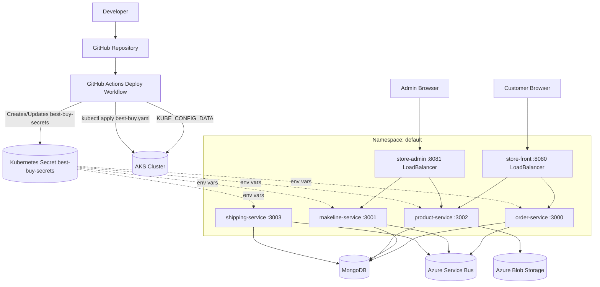

# Cloud-Native App for Best Buy

This repository deploys the Best Buy microservices stack to Kubernetes using GitHub Actions.

## Student Information
- **Name:** Akash Patel
- **Student ID:** 041269598
- **Course:** CST8916 - Winter 2026


## Architecure



## Deploy with GitHub Actions

The workflow file is:

- `.github/workflows/deploy.yml`

It will deploy automatically when:

- You push changes to `main` in `deployment_files/**`
- You run the workflow manually from the **Actions** tab (`workflow_dispatch`)

## Prerequisites

1. A running Kubernetes cluster (AKS, EKS, GKE, or any CNCF-compliant cluster).
2. `kubectl` access from your local machine.
3. A kubeconfig file for that cluster.
4. The Kubernetes secret `best-buy-secrets` created in the target namespace (default namespace if not specified).

## Configure GitHub Secrets

Create these repository secrets:

- `KUBE_CONFIG_DATA`
- `ASERVICE_BUS_CONNECTION_STRING`
- `MONGO_URI`
- `BLOB_CONNECTION_STRING`

Use `KUBE_CONFIG_DATA` as your kubeconfig encoded in base64.

### PowerShell (Windows)

```powershell
$kubeconfigPath = "$HOME\.kube\config"
[Convert]::ToBase64String([IO.File]::ReadAllBytes($kubeconfigPath))
```

Copy the output and add it in GitHub:

- Repo -> Settings -> Secrets and variables -> Actions -> New repository secret
- Name: `KUBE_CONFIG_DATA`
- Value: (paste base64 output)

The workflow will create or update Kubernetes secret `best-buy-secrets` automatically from the three application secrets.

## Run Deployment

1. Push to `main`, or
2. Open **Actions** -> **Deploy to Kubernetes** -> **Run workflow**.

The workflow executes:

1. Authenticate using `KUBE_CONFIG_DATA`
2. Create/update Kubernetes secret `best-buy-secrets`
3. Apply [deployment_files/best-buy.yaml](deployment_files/best-buy.yaml)
4. Wait for rollout success of all deployments

## Troubleshooting

- If deployment fails at kubeconfig step, verify `KUBE_CONFIG_DATA` exists and is valid base64.
- If workflow fails before deploy, verify GitHub Secrets are set: `ASERVICE_BUS_CONNECTION_STRING`, `MONGO_URI`, `BLOB_CONNECTION_STRING`.
- If rollout times out, inspect pods and events:

```bash
kubectl get pods
kubectl describe pod <pod-name>
kubectl get events --sort-by=.metadata.creationTimestamp
```

## Useful kubectl Commands

### View Resources

```bash
# List all deployments
kubectl get deployments -n default

# List all pods with details
kubectl get pods -n default -o wide

# List all services and external IPs
kubectl get svc -n default

# List all secrets
kubectl get secrets -n default

# View specific deployment details
kubectl describe deployment order-service -n default

# Watch pods in real-time
kubectl get pods -n default -w
```

### Monitor and Debug

```bash
# View pod logs (current)
kubectl logs -n default deployment/order-service --tail=200

# View pod logs (previous/crashed container)
kubectl logs -n default deployment/order-service --previous --tail=200

# Follow logs in real-time
kubectl logs -n default deployment/order-service -f

# Describe pod for events and status
kubectl describe pod <pod-name> -n default

# Get recent events in namespace
kubectl get events -n default --sort-by=.metadata.creationTimestamp | tail -n 50

# Check pod resource usage
kubectl top pod -n default

# Check node resource usage
kubectl top node
```

### Deployment Management

```bash
# Apply/update deployment
kubectl apply -f deployment_files/best-buy.yaml -n default

# Rollout status for deployment
kubectl rollout status deployment/order-service -n default --timeout=300s

# Rollout restart (forces new pod)
kubectl rollout restart deployment/order-service -n default

# Restart all deployments
kubectl rollout restart deployment -n default

# View rollout history
kubectl rollout history deployment/order-service -n default

# Rollback to previous version
kubectl rollout undo deployment/order-service -n default
```

### Secret Management

```bash
# View secret (encoded)
kubectl get secret best-buy-secrets -n default -o yaml

# View secret keys
kubectl get secret best-buy-secrets -n default -o jsonpath='{range $k,$v := .data}{$k}{"\n"}{end}'

# Create secret
kubectl create secret generic best-buy-secrets -n default \
  --from-literal=ASERVICE_BUS_CONNECTION_STRING="value" \
  --from-literal=MONGO_URI="value" \
  --from-literal=BLOB_CONNECTION_STRING="value"

# Update secret (dry-run + apply)
kubectl create secret generic best-buy-secrets -n default \
  --from-literal=ASERVICE_BUS_CONNECTION_STRING="new-value" \
  --from-literal=MONGO_URI="new-value" \
  --from-literal=BLOB_CONNECTION_STRING="new-value" \
  --dry-run=client -o yaml | kubectl apply -f -

# Delete secret
kubectl delete secret best-buy-secrets -n default
```

### Image and Container Management

```bash
# Update deployment image
kubectl set image deployment/order-service order-service=akash0898/order-service-bb:v2 -n default

# View current image for deployment
kubectl get deployment order-service -n default -o jsonpath='{.spec.template.spec.containers[0].image}'

# Force image pull policy always
kubectl patch deployment order-service -n default -p "{\"spec\":{\"template\":{\"spec\":{\"containers\":[{\"name\":\"order-service\",\"imagePullPolicy\":\"Always\"}]}}}}"
```

### Troubleshooting Deep Dive

```bash
# Get detailed pod info with YAML
kubectl get pod <pod-name> -n default -o yaml

# Get logs from all pods of a deployment
kubectl logs -n default -l app=order-service --tail=200

# Get resource quota usage
kubectl describe namespace default

# Check pod resource limits vs requests
kubectl get pod -n default -o jsonpath='{range .items[*]}{.metadata.name}{"\t"}{.spec.containers[*].resources}{"\n"}{end}'

# Watch deployment replicas
kubectl get deployment -n default -w

# Get pod events
kubectl describe pod <pod-name> -n default | grep -A 50 "Events:"
```

### Accessing Services

```bash
# Port-forward to service (local testing)
kubectl port-forward svc/store-front 8080:8080 -n default

# Port-forward to pod
kubectl port-forward pod/order-service-xxx 3000:3000 -n default

# Exec into pod for debugging
kubectl exec -it <pod-name> -n default -- /bin/sh

# Run a debug pod
kubectl run -it --image=alpine debug --rm -n default -- sh
```

### Health Checks

```bash
# Verify all deployments are healthy
kubectl get deployment -n default -o wide

# Check readiness of all pods
kubectl get pods -n default -o jsonpath='{range .items[*]}{.metadata.name}{"\t"}{.status.conditions[?(@.type=="Ready")].status}{"\n"}{end}'

# Get pod startup/readiness/liveness probe status
kubectl describe pod <pod-name> -n default | grep -A 5 "Probes"

# Check if pods are running
kubectl get pods -n default -o jsonpath='{range .items[*]}{.metadata.name}{"\t"}{.status.phase}{"\n"}{end}'
```

### Cleanup

```bash
# Delete specific deployment
kubectl delete deployment order-service -n default

# Delete all deployments
kubectl delete deployment --all -n default

# Delete namespace (deletes all resources in it)
kubectl delete namespace default
```

## Links

### Repository links

| Service          | Link                                               |
| ---------------- | -------------------------------------------------- |
| store-front      | https://github.com/Akash705-hub/store-front-bb      |
| store-admin      | https://github.com/Akash705-hub/store-admin-bb      |
| product-service  | https://github.com/Akash705-hub/product-service-bb  |
| order-service    | https://github.com/Akash705-hub/order-service-bb    |
| makeline-service | https://github.com/Akash705-hub/makeline-service-bb |
| shipping-service | https://github.com/Akash705-hub/shipping-service-bb |

### Docker Hub links

| Service          | Link                                                                          |
| ---------------- | ----------------------------------------------------------------------------- |
| store-front      | https://hub.docker.com/repository/docker/akash0898/store-front-bb/general     |
| store-admin      | https://hub.docker.com/repository/docker/akash0898/store-admin-bb/general      |
| product-service  | https://hub.docker.com/repository/docker/akash0898/product-service-bb  |
| order-service    | https://hub.docker.com/repository/docker/akash0898/order-service-bb/general    |
| makeline-service | https://hub.docker.com/repository/docker/akash0898/makeline-service-bb |
| shipping-service | https://hub.docker.com/repository/docker/akash0898/shipping-service-bb |

## Acknowledgments

This project was developed with assistance from **GitHub Copilot** for:

- **Code Troubleshooting:** Debugging deployment failures, container runtime errors, and service connectivity issues
- **Documentation:** Creating comprehensive setup guides, troubleshooting sections, and kubectl command references
- **Code Refactoring:** Optimizing GitHub Actions workflows, improving Kubernetes manifests, and ensuring best practices for CI/CD pipelines

GitHub Copilot provided intelligent suggestions and automated solutions that significantly accelerated development and deployment of this cloud-native application.

